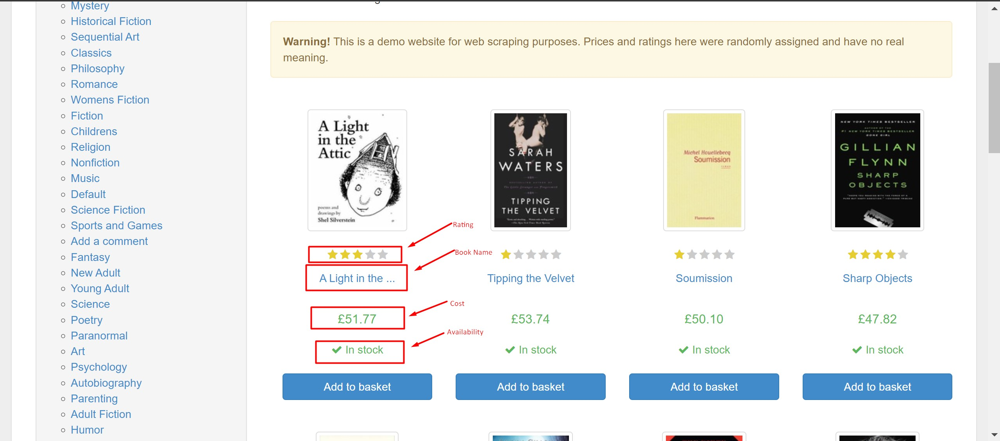

# Python-Web-Scrapers

This repository is a portfolio of Various web scraping methodologies I have used and a overview of what each method entails and how to implement it step by step.

 - *Its important to ensure legal data compliance when scraping data - ex: check the sites robots.txt*

## BeautifulSoup

- GET requests -  Simple scrapers similar to typing the site link and pressing enter. Can be used for static webpages. 

- POST requests - When there is a lot of data being communicated between the frontend andd backend we can use this method. Can be used for both static and dynamic pages. 

## Selenium

- Emulating your favourite web browser to collect data from various websites. This is used as a work around for complex JavaScript and ASPX webpages. This means each of these webpages are dynamic and BeautifulSoup cannot be used. The pictures below show how selenium can help in scraping data.

### Selecting the dates and location

### Raw ddata

## Scrapy

- WebScraping at a large and faster scale. This technique is used to collect data across multiple pages on a website. I have shown how to extract data from a sample website containing many pages of books. 

### Sample Data
