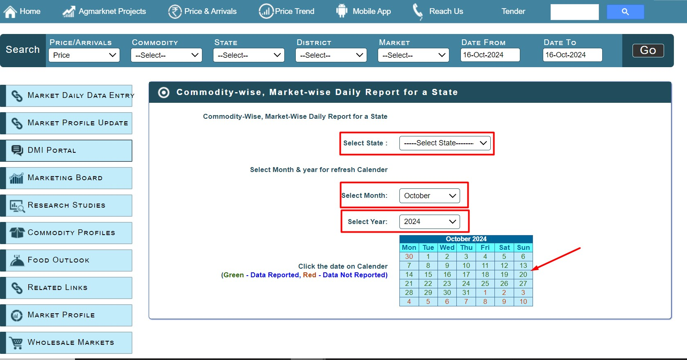
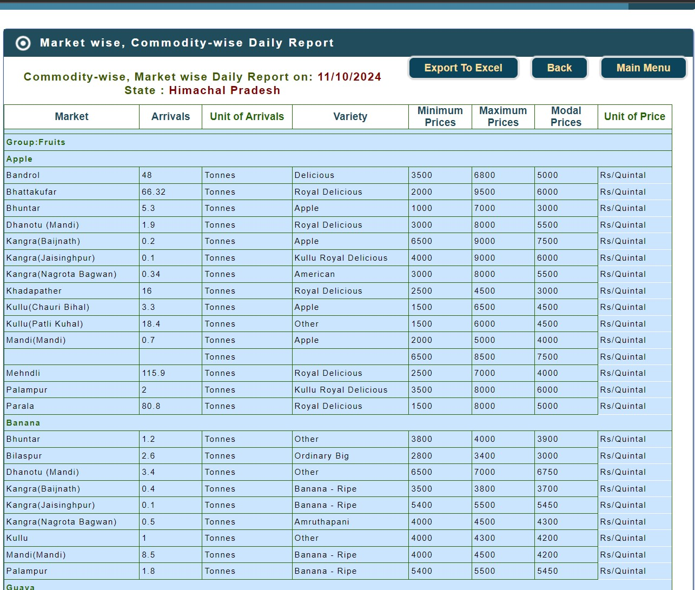
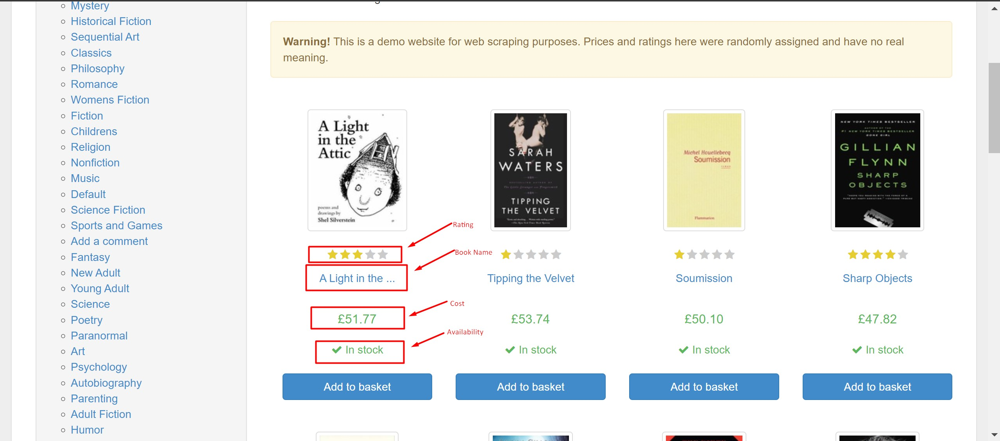

# Python-Web-Scrapers

This repository is a portfolio of Various web scraping methodologies I have used and a overview of what each method entails and how to implement it step by step.

 - *Its important to ensure legal data compliance when scraping data - ex: check the sites robots.txt*

## To Replicate

- Clone Repository
- Create a new environment with the `environment.yaml` file
- Activate new environment
- `pip install requirement.txt`
- Open the ipynb notebooks in Jupyter - Kernel --> Restart and Run 
- for scrapy bots, navigate to the spiders in the scrapy folder in the terminal --> scrapy crawl simpleCrawler

## BeautifulSoup

- GET requests -  GET requests are used by Simple scrapers similar to typing the site link and pressing enter. Can be used for static webpages. 
	- 
	- [Data Source](https://locations.traderjoes.com/)
	- [Source Code](BeautifulSoup/Beautiful%20Soup%20-%20GET%20Requests.ipynb)

- POST requests - When there is a lot of data being communicated between the frontend andd backend we can use this method. Can be used for both static and dynamic pages. 

	- [Data Source](https://dashboard.udiseplus.gov.in/#/reportDashboard/state)
	- [Source Code](BeautifulSoup/Beautiful%20Soup%20-%20POST%20Requests.ipynb)

## Selenium

- Emulating your favourite web browser to collect data from various websites. This is used as a work around for complex JavaScript and ASPX webpages. This means each of these webpages are dynamic and BeautifulSoup cannot be used. The pictures below show how selenium can help in scraping data.

- [Data Source](https://agmarknet.gov.in/PriceAndArrivals/CommodityDailyStateWise.aspx)
- [Source Code](Selenium/Selenium%20Web%20Scraper%20-%20aspx.ipynb)

### Selecting the dates and location

### Raw data

## Scrapy

- WebScraping at a large and faster scale. This technique is used to collect data across multiple pages on a website. I have shown how to extract data from a sample website containing many pages of books. 

- [Data Source](https://books.toscrape.com/)
- [Source Code](Scrapy/sampleSpider/sampleSpider/spiders/Sample_Crawler.py)

### Sample Data
